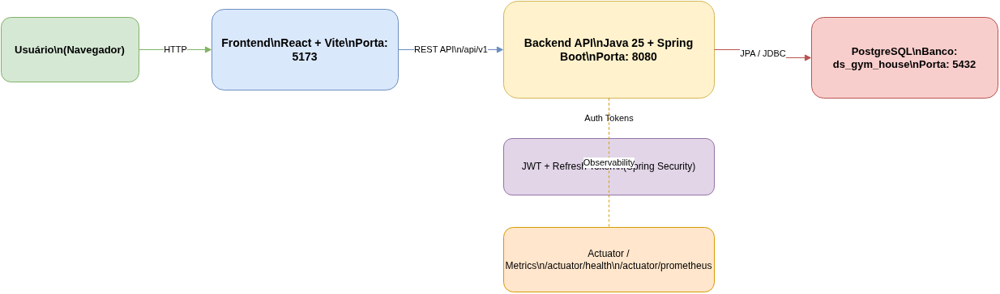
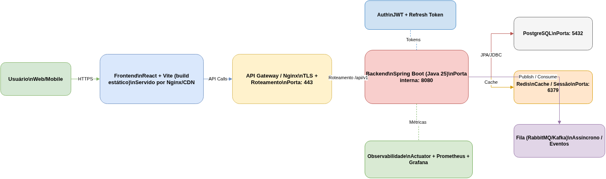
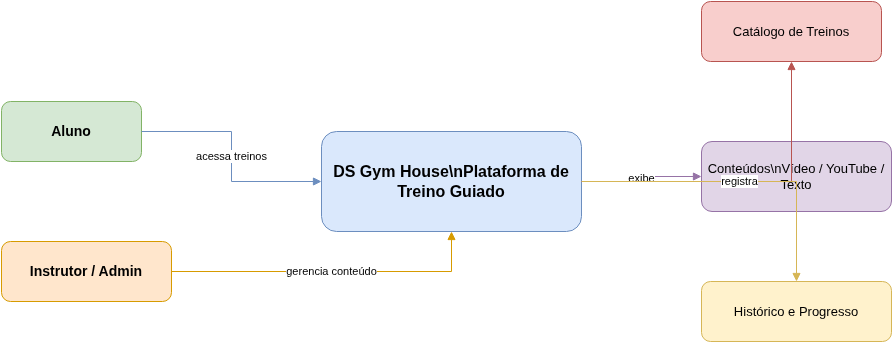
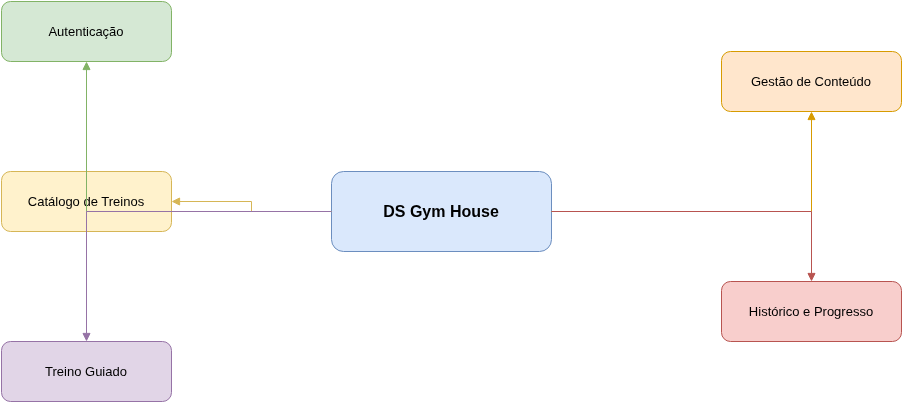
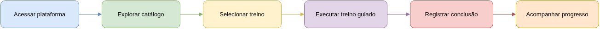

# DS Gym House


**DS Gym House** é um repositório de referência para demonstrar **Spec-Driven Development (SDD) na prática**, combinando **especificações claras**, **arquitetura evolutiva** e **implementação assistida por IA** em um produto realista de treino guiado para academia em casa.

O projeto funciona ao mesmo tempo como:

- referência de organização de produto e engenharia com SDD;
- laboratório de experimentação com IA aplicada ao desenvolvimento;
- base inicial para implementação de uma plataforma fitness digital.

---

## Sumário

- [Visão geral](#visão-geral)
- [O que é SDD](#o-que-é-sdd)
- [Princípios centrais](#princípios-centrais)
- [Objetivos do projeto](#objetivos-do-projeto)
- [História do sistema](#história-do-sistema)
- [Como o SDD funciona neste projeto](#como-o-sdd-funciona-neste-projeto)
- [Stack atual](#stack-atual)
- [Estrutura do repositório](#estrutura-do-repositório)
- [Organização SDD passo a passo](#organização-sdd-passo-a-passo)
- [Artefatos principais](#artefatos-principais)
- [Diagramas](#diagramas)
- [Estado atual](#estado-atual)
- [Próximos passos](#próximos-passos)
- [Plano de implementação](#plano-de-implementação)

## Visão geral

Em vez de começar pela implementação, o **DS Gym House** parte da especificação. A proposta é usar documentação de produto, requisitos, features, contratos de API e diagramas como base para decisões de arquitetura, geração de código, testes e evolução incremental.

Esse modelo reduz ambiguidade, melhora a comunicação entre produto e engenharia e facilita o uso de agentes de IA ao longo do ciclo de desenvolvimento.

## O que é SDD?

**Spec-Driven Development (SDD)** é uma abordagem em que as funcionalidades são definidas por meio de especificações antes do início da implementação.

Em vez de começar diretamente pelo código, o time descreve primeiro:

- comportamento esperado;
- entradas e saídas;
- regras de negócio;
- validações;
- critérios de aceitação.

Com isso, a especificação passa a ser a **fonte única da verdade** do sistema e serve como base para documentação, testes e implementação.

## Princípios centrais

### 1. Especificação primeiro

As funcionalidades são descritas antes de qualquer código ser escrito.

### 2. Contratos claros

Cada feature define com objetividade:

- entradas;
- saídas;
- regras de negócio;
- comportamento esperado.

### 3. Amigável à automação

As especificações podem ser consumidas por:

- agentes de IA;
- geração automatizada de testes;
- documentação técnica;
- validação de contratos.

### 4. Fonte única da verdade

A documentação de especificação orienta design, implementação e validação, reduzindo divergências entre áreas.

## Objetivos do projeto

Os principais objetivos do **DS Gym House** são:

- demonstrar **Spec-Driven Development na prática**;
- explorar **fluxos de desenvolvimento assistidos por IA**;
- organizar funcionalidades com **especificações claras e rastreáveis**;
- manter uma base com **arquitetura limpa e escalável**;
- oferecer um **ambiente de aprendizado e referência** para outros projetos.

## História do sistema

Imagine uma pessoa que quer cuidar da saúde, ganhar condicionamento físico ou manter uma rotina de exercícios, mas nem sempre consegue frequentar uma academia tradicional. Ela treina em casa, em horários variados, com equipamentos simples ou até mesmo apenas com o peso do corpo. Apesar da motivação, essa pessoa muitas vezes encontra dificuldades para organizar os treinos, acompanhar sua evolução e escolher conteúdos adequados para cada objetivo.

O **DS Gym House** nasce para resolver esse cenário, funcionando como uma plataforma de treino guiado para academia em casa. A proposta é oferecer uma experiência prática, acessível e personalizada, permitindo que o usuário encontre treinos prontos e siga orientações de forma simples, seja pelo celular, tablet ou computador.

Dentro do sistema, o usuário poderá acessar diferentes formatos de conteúdo para executar seus treinos:

- **treinos online guiados**, acompanhados em tempo real ou por streaming;
- **treinos salvos na plataforma**, organizados por objetivo, nível ou duração;
- **treinos com links externos**, como vídeos do YouTube;
- **instruções em texto**, com detalhes de execução, séries, repetições, tempo de descanso e observações importantes.

A ideia é que cada treino funcione como um roteiro claro. O usuário escolhe seu objetivo, encontra uma sugestão adequada e segue cada etapa com segurança. Em alguns casos, ele poderá apenas ler as instruções; em outros, assistir a um vídeo explicativo; e, em experiências mais completas, acompanhar um treino guiado online.

Além de consumir o conteúdo, o sistema também pode evoluir para registrar preferências, histórico e progresso do aluno. Isso permite criar uma jornada mais inteligente, em que a plataforma entende o perfil do usuário e oferece treinos mais compatíveis com sua realidade, como treinos rápidos para dias corridos, treinos iniciantes para novos alunos ou treinos mais intensos para usuários avançados.

Do ponto de vista de negócio, o sistema atende tanto alunos quanto profissionais. Os alunos ganham autonomia para treinar em casa com mais orientação e consistência. Já professores, personal trainers ou administradores da plataforma podem cadastrar e organizar conteúdos, estruturar programas de treino e disponibilizar materiais em diferentes formatos.

Em resumo, a história do **DS Gym House** é a de uma plataforma criada para transformar a casa do aluno em um ambiente de treino orientado, flexível e digital. O sistema conecta planejamento, conteúdo e acompanhamento para tornar a prática de exercícios mais acessível, organizada e motivadora.

Essa visão sustenta os requisitos, fluxos de usuário, regras de negócio e especificações funcionais do projeto.

## Como o SDD funciona neste projeto

O fluxo adotado neste repositório segue uma abordagem orientada por especificação:

1. uma especificação é criada na pasta `specs/`;
2. a especificação descreve funcionalidade, regras, contratos e respostas esperadas;
3. assistentes de código e agentes de IA usam esse material para acelerar implementação e testes;
4. desenvolvedores revisam, refinam e evoluem a solução.

Na prática, isso permite derivar a partir da especificação:

- controllers;
- services;
- repositories;
- testes automatizados;
- contratos de API;
- documentação técnica.

## Stack atual

As decisões técnicas já registradas para a v1 são:

| Camada | Stack |
| --- | --- |
| Backend | Java 25 + Spring Boot 3.5.7 |
| Frontend | React + Vite |
| Banco de dados | PostgreSQL |
| Persistência | Spring Data JPA (Hibernate) |
| Autenticação | JWT + Refresh Token |
| Contrato de API | OpenAPI v1 |
| Testes backend | JUnit + Spring Boot Test + MockMvc + H2 |

## Estrutura do repositório

O repositório está organizado para separar claramente **produto**, **especificação**, **implementação** e **planejamento**.

```text
.
├── README.md
├── TODO.md
├── backend/
│   ├── README.md
│   ├── pom.xml
│   └── src/
├── docs/
│   └── case-study/
│       └── estudo-de-caso.md
└── specs/
    ├── README.md
    ├── ROADMAP-DS-GYMHOUSE-NEXT.md
    ├── 00-product-vision/
    ├── 01-discovery/
    ├── 02-requirements/
    ├── 03-features/
    ├── 04-diagrams/
    ├── 05-technical-specs/
    └── specs-templates/
```

## Organização SDD passo a passo

### 1. Registrar o contexto do produto

Antes de escrever requisitos, foi criado um estudo de caso para definir cenário, atores, objetivos e escopo inicial.

### 2. Centralizar os artefatos em `specs/`

A pasta `specs/` concentra toda a base do processo SDD:

- `00-product-vision/`: visão, proposta de valor, objetivos e premissas;
- `01-discovery/`: personas, jornada, glossário e regras iniciais;
- `02-requirements/`: requisitos funcionais, não funcionais e histórias;
- `03-features/`: especificações por funcionalidade;
- `04-diagrams/`: diagramas draw.io e imagens exportadas;
- `05-technical-specs/`: contratos de API, OpenAPI e Postman;
- `specs-templates/`: kit reutilizável para outros projetos.

### 3. Separar as features principais

As primeiras funcionalidades foram isoladas em subpastas para manter clareza e rastreabilidade:

- `workout-catalog`;
- `guided-workout`;
- `content-management`;
- `progress-tracking`.

Cada uma possui `spec.md` com fluxo principal, fluxos alternativos, validações, regras, critérios de aceitação e rastreabilidade.

### 4. Modelar visualmente o domínio

Diagramas em draw.io foram criados para representar contexto, módulos, jornada do usuário e arquiteturas de referência.

### 5. Refinar para implementação técnica

Com a base funcional pronta, o projeto avançou para:

- contratos de API em Markdown;
- especificação OpenAPI v1;
- coleção Postman;
- plano de implementação por sprint;
- backend Spring Boot inicial.

### 6. Preparar a evolução do produto

O próximo ciclo natural segue a ordem:

1. concluir a fundação do ambiente local;
2. implementar autenticação e catálogo;
3. evoluir execução de treino e progresso;
4. concluir administração de conteúdo, qualidade e release.

## Artefatos principais

### Produto e descoberta

- estudo de caso: `docs/case-study/estudo-de-caso.md`
- guia geral das specs: `specs/README.md`
- visão do produto: `specs/00-product-vision/`
- discovery: `specs/01-discovery/`
- requisitos: `specs/02-requirements/`

### Features e diagramas

- features detalhadas: `specs/03-features/`
- diagramas draw.io e imagens: `specs/04-diagrams/`
- roadmap complementar: `specs/ROADMAP-DS-GYMHOUSE-NEXT.md`

### Especificações técnicas

- contratos de API: `specs/05-technical-specs/api-contracts-v1.md`
- OpenAPI: `specs/05-technical-specs/openapi-v1.yaml`
- Postman collection: `specs/05-technical-specs/postman-collection-v1.json`
- Postman environment: `specs/05-technical-specs/postman-environment-local.json`

### Implementação

- plano executável: `TODO.md`
- backend Spring Boot: `backend/`

## Diagramas

Os diagramas foram mantidos em formato fonte (`.drawio`) e também exportados em imagem (`.png` e `.jpg`).

- Arquitetura base: [PNG](specs/04-diagrams/ds-gym-house-architecture.png) | [JPG](specs/04-diagrams/ds-gym-house-architecture.jpg)
- Arquitetura de produção: [PNG](specs/04-diagrams/ds-gym-house-architecture-production.png) | [JPG](specs/04-diagrams/ds-gym-house-architecture-production.jpg)
- Contexto do sistema: [PNG](specs/04-diagrams/ds-gym-house-context.png) | [JPG](specs/04-diagrams/ds-gym-house-context.jpg)
- Módulos conceituais: [PNG](specs/04-diagrams/ds-gym-house-modules.png) | [JPG](specs/04-diagrams/ds-gym-house-modules.jpg)
- Jornada do usuário: [PNG](specs/04-diagrams/ds-gym-house-user-journey.png) | [JPG](specs/04-diagrams/ds-gym-house-user-journey.jpg)

### Visualização dos diagramas

#### Arquitetura base



#### Arquitetura de produção



#### Contexto do sistema



#### Módulos conceituais



#### Jornada do usuário



## Estado atual

Neste momento, o projeto já possui uma base sólida para sair da especificação e seguir para implementação incremental.

### O que já está pronto

- visão do produto definida;
- estudo de caso documentado;
- discovery consolidado;
- requisitos funcionais e não funcionais formalizados;
- histórias de usuário com critérios de aceitação;
- features detalhadas com regras, fluxos e validações;
- contratos de API, OpenAPI e coleção Postman;
- backend Spring Boot inicializado;
- testes unitários iniciais do backend adicionados;
- diagramas técnicos e funcionais publicados.

### O que ainda falta para a v1

- inicializar o frontend;
- configurar lint, formatter e scripts;
- criar `.env.example`;
- configurar Docker local;
- implementar os fluxos principais da OpenAPI v1.

## Próximos passos

Os próximos passos mais naturais a partir do estado atual são:

1. concluir os itens pendentes da Sprint 0;
2. implementar autenticação e catálogo de treinos;
3. evoluir o fluxo de conclusão de treino e progresso;
4. entregar a área administrativa de conteúdo;
5. consolidar qualidade, CI/CD e release.

## Plano de implementação

O plano executável para finalizar a v1 está em [TODO.md](TODO.md).
