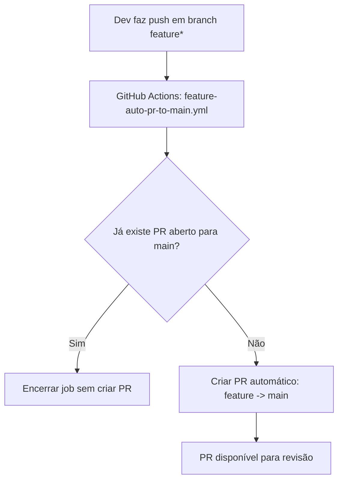

# Requisitos Não Funcionais Úteis

Este diretório concentra prompts e estratégias práticas de NFR para automações, qualidade e operação.

## Diagrama CI/CD — Auto PR (feature -> main)

Referências:
- Prompt: [specs/06-requisitos-nao-funcionais-uteis/prompt-auto-pr-feature-main.md](specs/06-requisitos-nao-funcionais-uteis/prompt-auto-pr-feature-main.md)
- Workflow: [.github/workflows/feature-auto-pr-to-main.yml](.github/workflows/feature-auto-pr-to-main.yml)
